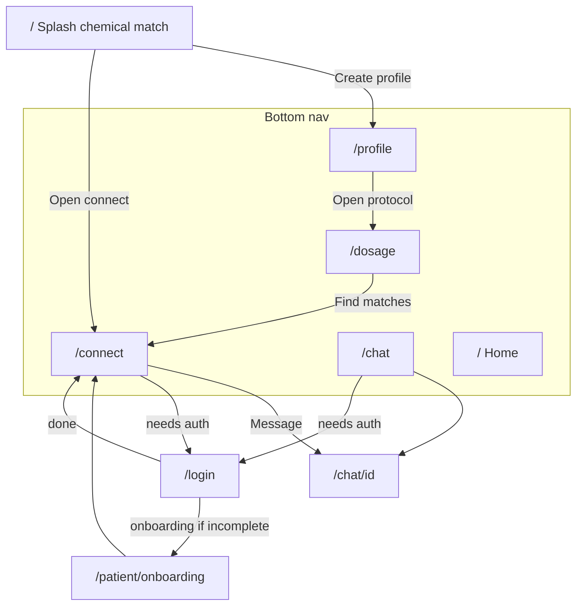

# Deepdose site architecture

Lean, Sniffies-slick, chemistry-first consumer webapp. One shell, five bottom tabs, no duplicate dashboards.

## Sniffies patterns we clone (not the product)

| Sniffies | Deepdose |
|----------|----------|
| Map = discovery home | `/connect` = chemistry matches (grid/cards, not geo map) |
| Tap profile → Message | Match card → `/chat/[id]` |
| Chats inbox | `/chat` |
| Own profile | `/profile` (SRI + account) |
| Status / intent | `/dosage` (six-dose protocol + med timing) |
| Soft entry | Splash + draft profile/dosage; login on Message |
| Bottom chrome | Bottom nav only on product routes |
| Browser webapp | Dark shell + fixed bottom nav |

We do **not** clone cruising maps, position icons, or meetup pins.

## Consumer IA

### Five tabs

| Tab | Route | Job |
|-----|-------|-----|
| Home | `/` | Chemical-match splash |
| Connect | `/connect` | Discovery / matches |
| Chat | `/chat` | Inbox + threads |
| Profile | `/profile` | Chemistry + SRI + account |
| Dosage | `/dosage` | Protocol + live timing |

**Post-login default:** `/connect` when onboarding is complete. Incomplete onboarding interrupts via `/patient/onboarding/*`.

## Flows

1. **Guest:** `/` → Create profile → `/profile` (draft) → Message → `/login` → onboarding if needed → `/connect`
2. **Match → chat:** `/connect` → Message (soft gate) → `/chat` inbox → thread `/chat/[id]`
3. **Protocol:** Dosage tab or profile CTA → `/dosage`
4. **Returning user:** `/login` → `/connect`

## KEEP / MERGE / CUT

### KEEP (hot path)
`/`, `/connect`, `/chat`, `/chat/[id]`, `/profile`, `/dosage`, `/login`, `/terms`, `/patient/onboarding/*`

### MERGE
| From | Into |
|------|------|
| `/patient/dashboard` timing | `/dosage` (authed) |
| Match panels on patient dashboard | `/connect` only |
| `/patient/profile`, devices, rhythm, meds | `/profile` sections |
| `/share`, `/membership` | Profile settings (later) |
| `/mission` + `/about` | `/mission` (splash/menu only) |
| Science cluster | `/science` hub (off hot path) |

### CUT from consumer chrome
- Removed stubs: `/dose-dash-preview`, public `/consent` → 301s in `next.config.ts`
- Legacy 301s (no page modules): `/evidence`, `/research`, `/foundation`, `/problem`, `/partners`, `/check`, `/risk`, `/about`, `/dashboard`, `/patient/dashboard`
- 11-link product header → bottom nav only
- Parallel `PatientSiteNav` → same bottom nav when authed

### Out of consumer app
`/clinical/*`, `/enterprise/*` and their landings (tier-gated).

## Chrome rules

- **Product routes** (`/connect`, `/chat`, `/profile`, `/dosage`, `/login`): bottom nav, no marketing header link farm
- **Splash `/`**: Sniffies-style gate — on-page signup, age/legal footer; no bottom nav; no marketing header
- **Marketing** (`/mission`, `/science`, `/safety`, …): optional slim header; not in bottom nav

## Code anchors

- Bottom nav: `src/lib/deepdose-marketing/app-bottom-nav.ts`
- Splash/marketing links: `src/lib/deepdose-marketing/site-nav-links.ts`
- Post-login: `src/lib/auth/post-login-path.ts`
- Onboarding complete path: `src/lib/onboarding/resolve.ts`
